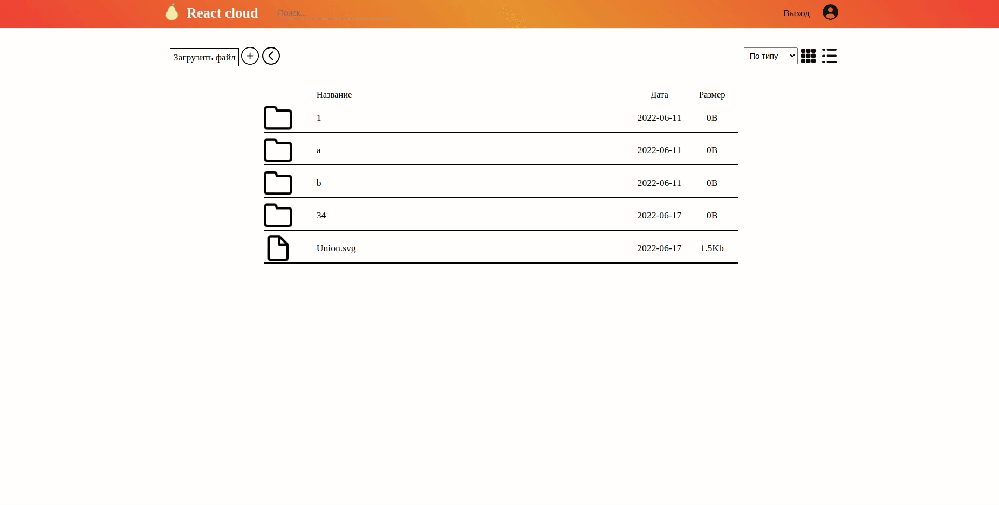
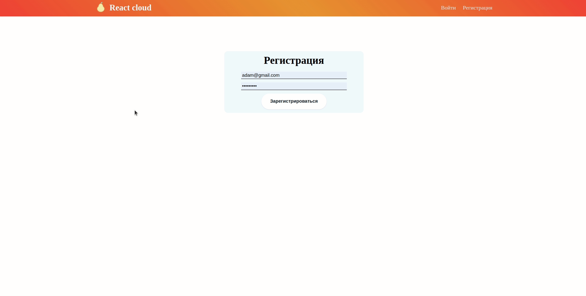
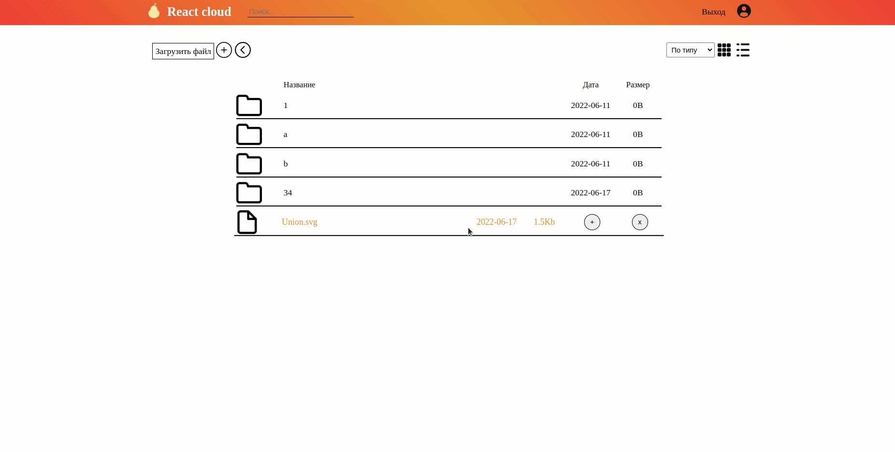
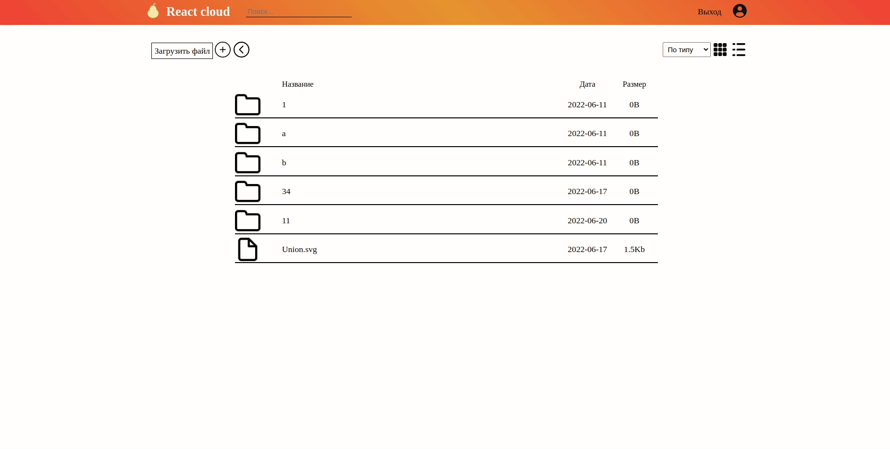

# MERN
___

___
## Пример облачного хранилища, где мы можем создавать каие-либо папки и загружать файлы
Это проект с серверной и клиентской частью, с акцентом на функциональную часть(есть недоработки).
Проект создан с на базе такого стека, как  MERN(Mongodb, Express, React, Node)


#### Для старта необходимо подключиться к базе данных:
```
git clone https://github.com/deniskots/react-cload.git

yarn

yarn server

yarn start
```
___
## Авторизация и регистрация 

___

___
## Создание папок
___

## Загрузка файлов и удаление
Также работает метод загрузки через перетаскивания в область загрузки
___
